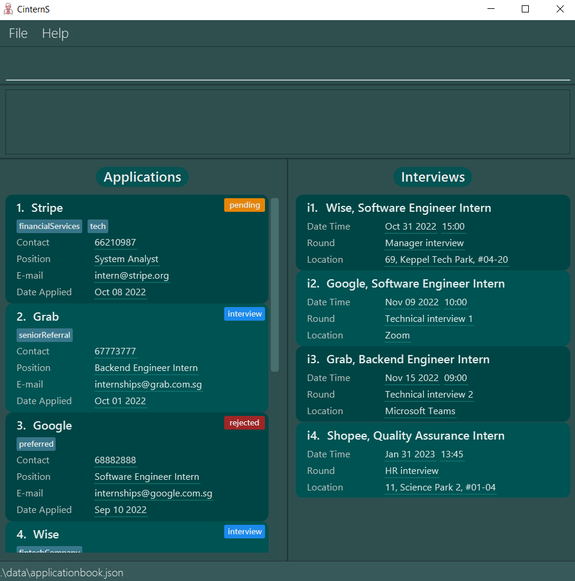
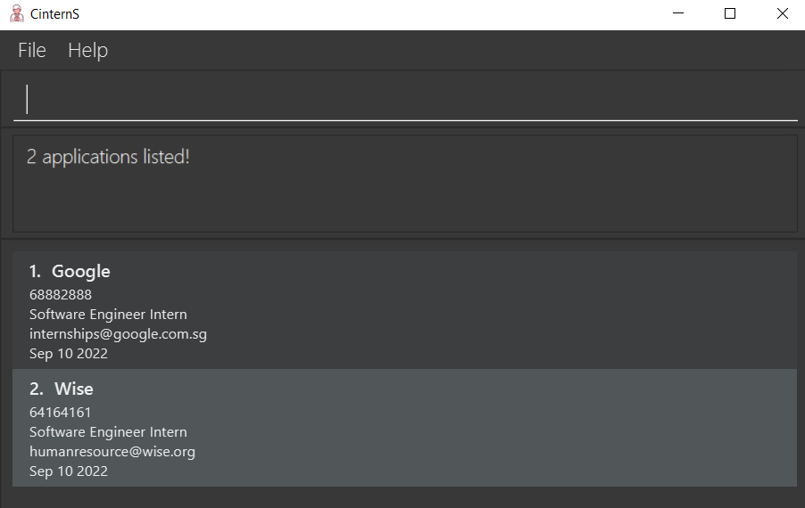

# User Guide
**CinternS** is a **desktop app for managing internship applications, optimised for use via a Command Line Interface** (CLI) while still having the benefits of a Graphical User Interface (GUI). If you can type fast, **CinternS** can get your internship application management tasks done faster than traditional GUI apps. It consists of several useful features which the users are able to execute using commands.

* [Quick Start](#quick-start)
* [Features](#features)
    * [Getting help: `help`](#getting-help-help)
    * [Adding an internship application: `add`](#adding-an-internship-application-add)
    * [Listing all internship applications: `list`](#listing-all-internship-applications-list)
    * [Listing all archived internship application: `list-archive`](#listing-all-archived-internship-applications)
    * [Deleting an internship application: `delete`](#deleting-an-internship-application-delete)
    * [Finding an internship application: `find`](#finding-an-internship-application-find)
    * [Editing an internship application: `edit`](#editing-an-internship-application-edit)
    * [Archiving an internship application: `archive`](#archiving-an-internship-application-archive)
    * [Retrieving an internship application from archives: `retrieve`](#retrieving-an-internship-application-from-archives-retrieve)
    * [Clearing all entries: `clear`](#clearing-all-entries-clear)
    * [Exiting the program: `exit`](#exiting-the-program-exit)
    * [Saving the data](#saving-the-data)
* [FAQ](#faq)
* [Command summary](#command-summary)

--------------------------------------------------------------------------------------------------------------------

## Quick start

1. Ensure you have Java `11` or above installed in your Computer.

2. Download the latest `cinterns.jar` from [here](https://github.com/AY2223S1-CS2103-F14-3/tp/releases).

3. Copy the file to the folder you want to use as the _home folder_ for your **CinternS** app.

4. Double-click the file to start the app. The GUI similar to the below should appear in a few seconds. When the app is started for the first time, sample data is included to help you get started. 
   

5. Type the command into the command box and press Enter to execute it. e.g. typing **`list`** and pressing Enter will display the applications currently in **CinternS**. 
   Some example commands you can try:
    * **`help`**: Shows a message explaining the way to access help page.
   
    * **`list`** : Displays internship application.
   
    * **`list-archive`** : Displays archived internship application.
   
    * **`add`**`c/Google ct/11111111 d/2022-01-01 e/google@example.com p/Software Engineer` : Adds an internship application that was submitted on `2022-01-01` to `Google` with contact number `11111111` and email `google@example.com` for the role of `Software Engineer` to **CinternS**.

    * **`delete`**`2` : Deletes the 2nd application shown in the current list.
   
    * **`find`**`google` : Finds the applications that contain keyword **google** in their company name and/or position.
   
    * **`edit`**`1 e/hr@internship.sg`: Edits the 1st application shown in the current list with new email address.
   
    * **`archive`**`3`: Archives the 3rd application shown in the current list. The application must be not archived.
   
    * **`retrieve`**`1`: Retrieves the 1st application shown in the current list. The application must be archived.
   
    * **`clear`**: Clears CinternS data.

    * **`exit`** : Exits the app.

6. Refer to the [Features](#features) section below for details of each command.

--------------------------------------------------------------------------------------------------------------------

## Features

**:information_source: Notes about the command format:** 

* Words in `UPPER_CASE` are the parameters to be supplied by the user. 
  e.g. in `add c/COMPANY_NAME`, `COMPANY_NAME` is a parameter which can be used as `add c/Google`.

* Items in square brackets are optional.
  e.g `c/COMPANY_NAME [t/TAG]` can be used as `c/Google t/preferred` or as `c/Google`.

* Items with `...` after them can be used multiple times including zero times.
  e.g. `[t/TAG]...` can be used as ` ` (i.e. 0 times), `t/preferred`, `t/preferred t/techCompany` etc.

* Parameters can be in any order. 
  e.g. if the command specifies `d/DATE_APPLIED p/POSITION`, `p/POSITION d/DATE_APPLIED` is also acceptable.

* If a parameter is expected only once in the command but you specified it multiple times, only the last occurrence of the parameter will be taken.
  e.g. if you specify `ct/12341234 ct/62226222`, only `ct/62226222` will be taken.

* Extraneous parameters for commands that do not take in parameters (such as `list` and `exit`) will be ignored. 
  e.g. if the command specifies `list 123`, it will be interpreted as `list`.

### Viewing help: `help`
Shows a message explaining how to access the help page

Format: `help`

### Adding an internship application: `add`

Adds an internship application to the list.

Format: `add c/COMPANY_NAME ct/CONTACT_NUMBER d/DATE_APPLIED e/EMAIL p/POSITION [t/TAG]...`

:bulb: <b>Tip:</b>
Date must be specified in the format <em>yyyy-MM-dd</em>.

 

Examples:
* `add c/Google ct/11111111 d/2022-01-01 e/google@example.com p/Software Engineer t/preferred`
* `add c/Facebook ct/22222222 d/2022-01-02 e/facebook@example.com p/Backend Engineer`

### Listing all internship applications: `list`

Displays all the internship applications in the list.

Format: `list`

### Listing all archived internship applications:

Displays all the archived internship applications in the list.

Format: `list-archive`

### Deleting an internship application: `delete`

Deletes the specified internship application from the list.

Format: `delete INDEX`

* Deletes the internship application at the specified `INDEX`.
* The index refers to the index number shown in the displayed internship application list.
* The index **must be a positive integer** 1, 2, 3, …​
* The index must be within the range of available internships in the application list.

Examples:
* `list` followed by `delete 2` deletes the 2nd internship application in the list.

### Finding an internship application: `find`

Finds applications whose companies or positions contain any of the given keywords.

Format: `find KEYWORD [MORE_KEYWORDS]`

* The search is case-insensitive. e.g `google` will match `Google`
* The order of the keywords does not matter. e.g. `Tech Micron` will match `Micron Tech`
* Only the company and position is searched.
* Only full words will be matched e.g. `ByteDance` will not match `ByteDances`
* Applications matching at least one keyword will be returned (i.e. `OR` search). e.g. `Google Shopee` will return `Shopee HQ`, `Google Singapore`

Examples:
* `find Software` returns `Google` and `Wise` application whose position contain software keyword.

### Editing an internship application: `edit`
Edits an existing application in the CinternS.

Format: `edit INDEX [n/COMPANY] [ct/CONTACT] [e/EMAIL] [p/POSITION] [d/DATE_APPLIED] [t/TAG]...`

* Edits the application at the specified `INDEX`. 
* The index refers to the index number shown in the displayed application list. 
* The index **must be a positive integer** 1, 2, 3, …​
* At least one of the optional fields must be provided.
* Existing values will be updated to the input values.
* When editing tags, the existing tags of the application will be removed i.e adding of tags is not cumulative.
* You can remove all the application’s tags by typing `t/` without specifying any tags after it.

Examples:

`edit 1 ct/91234567 e/grab@example.com` edits the contact and email of the 1st application to be 91234567 and grab@example.com respectively.
`edit 2 c/Garena t/` edits the company of the 2nd application to be `Garena` and clears all existing tags.

### Archiving an internship application: `archive`

Archives the specified internship application from the list.

Format: `archive INDEX`

* Archives the internship application at the specified `INDEX`.
* The application specified must be not archived.
* The index refers to the index number shown in the displayed internship application list.
* The index **must be a positive integer** 1, 2, 3, …​
* The index must be within the range of available internships in the shown application list.

Examples:
* `list` followed by `archive 2` archives the 2nd internship application in the list.

### Retrieving an internship application from archives: `retrieve`

Retrieves the specified internship application from the list.

Format: `retrieve INDEX`

* Retrieves the internship application at the specified `INDEX`.
* The application specified must be archived, `list-archive` command is recommended to be used before using this command.
* The index refers to the index number shown in the displayed internship application list.
* The index **must be a positive integer** 1, 2, 3, …​
* The index must be within the range of available internships in the shown application list.

Examples:
* `list-archive` followed by `retrieve 1` retrieves the 1st internship application in the list.

### Clearing all entries: `clear`
Clears all entries from CinternS.

Format: `clear`

### Exiting the program: `exit`
Exits the program.

Format: `exit`

### Saving the data

The data of all the internship applications is saved automatically to the hard disk whenever any changes are made, so no manual saving is necessary.

--------------------------------------------------------------------------------------------------------------------

## FAQ

**Q**: What should I do if the program crashes? 
**A**: Screenshot the error message (if any) and report to us via [email](mailto:seer@comp.nus.edu.sg) or github issue [here](https://github.com/AY2223S1-CS2103-F14-3/tp/issues). 
We will assist you as soon as possible.

**Q**: Is **CinternS** supported on mobile platforms? 
**A**: No. **CinternS** is only available on PC now.

**Q**: Will my data be lost after updating the program? 
**A**: No. All your data will remain the same as long as you keep your data file.

**Q**: How do I transfer my data to another computer? 
**A**: Install the app in the other computer and overwrite the original empty data file with the save file that contains the data of your previous **CinternS** home folder.

--------------------------------------------------------------------------------------------------------------------

## Command summary

| Action          | Format, Examples                                                                                                                                                                            |
|-----------------|---------------------------------------------------------------------------------------------------------------------------------------------------------------------------------------------|
| **Help**        | `help`                                                                                                                                                                                      |
| **Add**         | `add c/COMPANY_NAME ct/CONTACT_NUMBER d/DATE_APPLIED e/EMAIL p/POSITION [t/TAG]...`   e.g., `add c/Google ct/11111111 d/2022-01-01 e/google@example.com p/Software Engineer t/preferred` |
| **List**        | `list`                                                                                                                                                                                      |
| **ListArchive** | `list-archive`                                                                                                                                                                              |
| **Delete**      | `delete INDEX`  e.g., `delete 2`                                                                                                                                                         |
| **Find**        | `find KEYWORD [MORE_KEYWORDS]`  e.g., `find engineer`                                                                                                                                    |
| **Edit**        | `edit INDEX [n/COMPANY] [ct/CONTACT] [e/EMAIL] [p/POSITION] [d/DATE_APPLIED] [t/TAG]...`  e.g., `edit 2 c/Grab d/2022-10-10`                                                             |
| **Archive**     | `archive INDEX`  e.g., `archive 2`                                                                                                                                                       |
| **Retrieve**    | `retrieve INDEX`  e.g., `retrieve 2`                                                                                                                                                     |
| **Clear**       | `clear`                                                                                                                                                                                     |
| **Exit**        | `exit`                                                                                                                                                                                      |

--------------------------------------------------------------------------------------------------------------------
